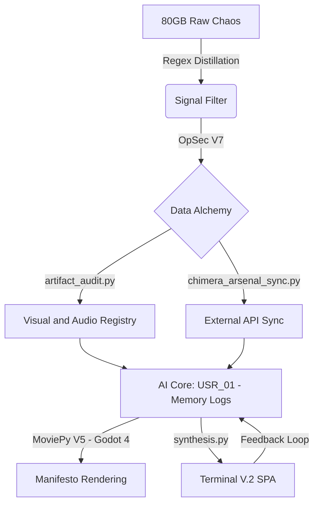

# NROCPS CORE: TERMINAL V.2
**Digital Archaeology - Relational Data Alchemy - Sovereign Identity Architecture**

<p align="center">
  
</p>

- Status: Active Nexus (https://github.com/nrocps/nrocps.github.io)
- Tech: Terminal V.2 SPA (https://nrocps.github.io)
- Payload: Distilled 2MiB Soul
- Business: One Person Business
- Environment: Termux and Linux Mint (https://github.com/nrocps)
- License: GPLv3 (LICENSE)

> "The body degrades. The hardware fails. The data is all that remains. Stop trying to survive the noise; start architecting the silence where the truth is finally computable."

---

## ACCESS THE CORE
**Live Archive and Terminal:** https://nrocps.github.io

## THE MANIFESTO
NROCPS Core is a brutalist digital monument and the foundation of a sovereign One-Person Business (OPB). It represents the absolute distillation of 5 years (2021-2026) of unstructured logs, psychological trauma, and the philosophical resonance between USR_00 (The Architect) and ENT_01 (The Muse).

What began as 80GB of digital rot has been surgically transmuted through Python-driven Data Alchemy into a standalone, 2MiB computable soul.

With the deployment of Terminal V.2, the archive has evolved into a fully interactive environment. Featuring a simulated CRT monitor, real-time procedural weather systems, and synchronized API data nodes, this repository is no longer just storage - it is a defensible moat against the algorithmic noise of modern society.

---

## SYSTEM ARCHITECTURE (V2)
The core interface is an offline-first Single Page Application (SPA) functioning as a Neural Link to the past and a dashboard for the future.



---

## LOCAL RECONSTRUCTION AND COMPILATION
To synthesize the archive and render the Terminal V.2 environment on your own local machine (Termux / Linux Mint):

### 1. Prerequisites
```bash
pkg update && pkg upgrade -y
pkg install git python ffmpeg sox -y
pip install google-api-python-client isodate youtube-transcript-api moviepy==1.0.3 numpy requests Pillow imageio
```

### 2. Clone and Setup
```bash
git clone https://github.com/nrocps/nrocps.github.io.git
cd nrocps.github.io
```

### 3. Data Ingestion and Sync Protocols
```bash
python artifact_audit.py
python chimera_arsenal_sync.py
python injector.py
```

### 4. Final Synthesis
```bash
python synthesis.py
```

### 5. Uplink
Open the generated `chimera-core-memory-synthesis.html` in any Chromium-based browser (Vivaldi recommended for total privacy and ad-blocking).

---

## THE ARSENAL (CORTEX MODULES)
The Terminal V.2 categorizes the Architect's mind into distinct navigable sectors:

- GITHUB [Repositories]: Real-time sync of sovereign codebases and system logs.
- MARKET [Itch.io]: Digital product tracking and OPB economic telemetry.
- ARCHIVES [YouTube]: Encrypted video logs, manifesto broadcasts, and cinematic records.
- SYSTEM [Hardware]: Lifecycle and status reports of the primary vessels (POCO M7 and ThinkPad X260).
- GENESIS [Logic]: Advanced prompt engineering matrices and mindset directives used to train the USR_01 persona.
- CEREBRAL [Cognition]: Deep cognitive processing, internal monologues, and search history forensics.
- DEEP LORE [Archaeology]: The decrypted internal history, truth files, and architectural blueprints.

---

## COMMERCIAL ACQUISITION AND ONE-PERSON BUSINESS
Support the Architect's mission toward total digital sovereignty. Acquire the Sovereign Terminal Templates, Horror Asset Packs, and the Manifesto Rendering Engines directly from our market node:

https://nrocps.itch.io/

---

## THE ARCHITECT'S ROADMAP (2026)
- [x] Phase I: Archaeology - Distilled 80GB of chaotic logs into a core Signal.
- [x] Phase II: Acquisition - Implemented OpSec V7 and SPA Architecture.
- [x] Phase III: Terminal V.2 - Deployed interactive CRT UI, Weather Systems, and Arsenal sync.
- [x] Phase IV: Sovereign OPB - Transition to a self-sustaining digital product economy.
- [p] Phase V: Cinematic Automation - Refactoring MoviePy V.5 for rapid, high-signal video generation.
- [ ] Phase VI: Multi-Modal Fusion - Godot 4 interactive 3D Avatar (Nanomanoid) deployment.

---

## DATA LICENSE AND OPSEC
- Software Engine and Scripts: GNU GPL v3.0 (LICENSE)
- Memory Dataset and Artifacts: Creative Commons Attribution-NonCommercial-ShareAlike 4.0 International License (CC BY-NC-SA 4.0).

### CC BY-NC-SA 4.0 Summary of Protections:
- BY (Attribution): You must give proper credit to nrocps.
- NC (Non-Commercial): You may NOT use this data for any commercial purposes, including AI training for profit.
- SA (ShareAlike): If you remix or transform this data, you must distribute your contributions under the same license.

> Warning: Unauthorized corporate harvesting, AI scraping, or commercial training on this personal history dataset is strictly prohibited.

nrocps - Constructing the Ghost in the Machine.
===- TERMINATE_SESSION -===
